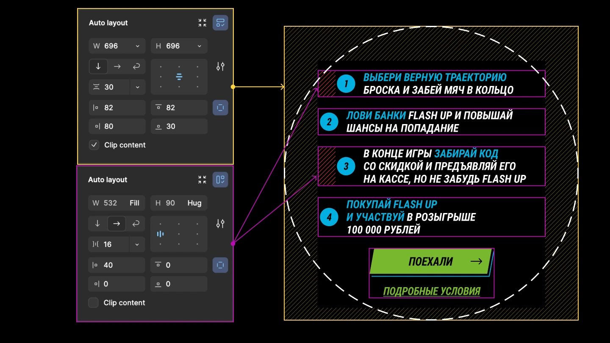

# Идеальный макет

это тот, который делал frontend-разработчик)

<br>

- Размеры макетов
- Динамика в макетах
    - Позиционирование и маски
    - Auto Layout
    - Всё есть прямоугольник
- Не стандартные рамки

<v-drag pos="610,0,360,1000,1">
  <video controls='false' autoplay="autoplay" muted loop width="360"  src="./assets/1/prog_vs_des.mp4"></video>
</v-drag>

---

# Проблемы дизайна и не компетенции заказчика

А так же сжатые сроки, отсутствие тз и т.д.

<br>


---

# Размеры макетов

Мобильные устройства

<div class="flex gap-8">
    
    
    
    
</div>

---

# Размеры макетов

Десктоп устройства


<v-drag pos="52,124,1000,_,0">
    
</v-drag>

---

# Динамика в макетах

Позиционирование и маски

<v-drag pos="30,124,2000,_,0">
    
</v-drag>

<v-drag pos="30,124,2000,_,0">
    
</v-drag>

<v-drag pos="30,124,2000,_,0">
    
</v-drag>

<v-drag pos="30,124,2000,_,0">
    
</v-drag>

<v-drag pos="30,124,2000,_,0">
    
</v-drag>

---

# Динамика в макетах

Auto Layout

<v-drag pos="50,124,2000,_,0">
    
</v-drag>

<v-drag pos="50,124,2000,_,0">
    
</v-drag>

<v-drag pos="50,124,2000,_,0">  
    
</v-drag>

<v-drag pos="50,124,2000,_,0">
    
</v-drag>

---

# Динамика в макетах

Всё есть прямоугольник

<v-drag pos="50,124,2000,_,0">
    
</v-drag>

<v-drag pos="50,124,2000,_,0">
    
</v-drag>

<v-drag pos="50,124,2000,_,0">  
    
</v-drag>

---

# Не стандартные рамки

Прикольно, но очень сложно

<v-drag pos="50,124,2000,_,0">
    
</v-drag>

<v-drag pos="50,124,2000,_,0">
    
</v-drag>

<v-drag pos="50,180,2000,_,0">
    
</v-drag>

<v-drag pos="50,180,2000,_,0">
    
</v-drag>

<v-drag pos="50,180,2000,_,0">
    
</v-drag>

---

# Не стандартные рамки

Максимум духоты

<div class="ts-code">

```ts
import { path } from "d3-path";

var TAB_INFO_PATH = <const>{
	WIDTH: 300.0,
	HEIGHT: 160.0,
	LABEL_BOT_SHIFT: 20.0,
	RADIUS: {
		LARGE: 60.0,
		MEDIUM: 30.0,
	},
};

type CreateSvg = { width: number; height: number };
type Label = { left: number; width: number };

export var createSvgPathTabInfo = (
	offset: CreateSvg = { width: TAB_INFO_PATH.WIDTH, height: TAB_INFO_PATH.HEIGHT },
	pixelSize: number = 1.0,
	label: Label = { left: -0, width: 100.0 }
): string => {
	var d = path(),
		width = offset.width - TAB_INFO_PATH.WIDTH * pixelSize,
		height = offset.height - TAB_INFO_PATH.HEIGHT * pixelSize,
		left = TAB_INFO_PATH.HEIGHT * pixelSize + height - pixelSize,
		right = TAB_INFO_PATH.WIDTH * pixelSize + width - pixelSize,
		labelBotShift = TAB_INFO_PATH.LABEL_BOT_SHIFT * pixelSize,
		radius = <const>{
			large: TAB_INFO_PATH.RADIUS.LARGE * pixelSize,
			medium: TAB_INFO_PATH.RADIUS.MEDIUM * pixelSize,
		},
		isStart = label.left < labelBotShift + radius.large + radius.medium,
		labelPointsLeft = {
			top: isStart ? 0.0 + pixelSize : label.left,
			bot: isStart ? 0.0 + pixelSize : label.left - labelBotShift,
		},
		labelPointsWidth = {
			top: label.width + labelPointsLeft.top,
			bot: label.width + labelPointsLeft.bot + labelBotShift * (isStart ? 1 : 2),
		},
		points = <const>[
			{ x: 150, y: left },
			{ x: 0.0 + pixelSize, y: left },
			{ x: 0.0 + pixelSize, y: 98.0 * pixelSize },
			{ x: labelPointsLeft.bot, y: 98.0 * pixelSize },
			{ x: labelPointsLeft.top, y: 0.0 + pixelSize },
			{ x: labelPointsWidth.top, y: 0.0 + pixelSize },
			{ x: labelPointsWidth.bot, y: 98.0 * pixelSize },
			{ x: right, y: 98.0 * pixelSize },
			{ x: right, y: left },
		];

	d.moveTo(points[0].x, points[0].y);
	d.arcTo(points[1].x, points[1].y, points[2].x, points[2].y, radius.medium);
	d.arcTo(points[2].x, points[2].y, points[3].x, points[3].y, radius.medium);
	// // //
	d.arcTo(points[3].x, points[3].y, points[4].x, points[4].y, radius.large);
	d.arcTo(points[4].x, points[4].y, points[5].x, points[5].y, radius.medium);
	d.arcTo(points[5].x, points[5].y, points[6].x, points[6].y, radius.medium);
	d.arcTo(points[6].x, points[6].y, points[7].x, points[7].y, radius.large);
	// // //
	d.arcTo(points[7].x, points[7].y, points[8].x, points[8].y, radius.medium);
	d.arcTo(points[8].x, points[8].y, points[0].x, points[0].y, radius.medium);
	d.closePath();

	return d.toString();
};
```

</div>

<style>
.ts-code {
    width: 400px;
}

.ts-code pre {
  font-size: 4px !important;
  line-height: 4px !important;
}
</style>
